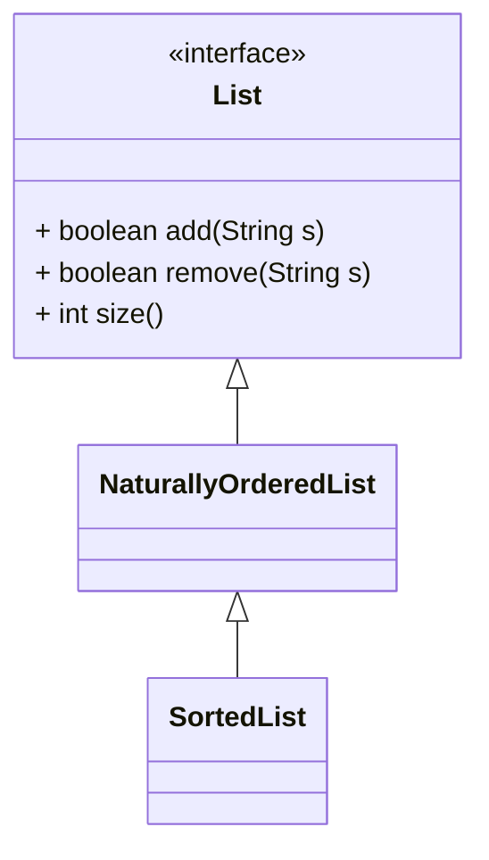
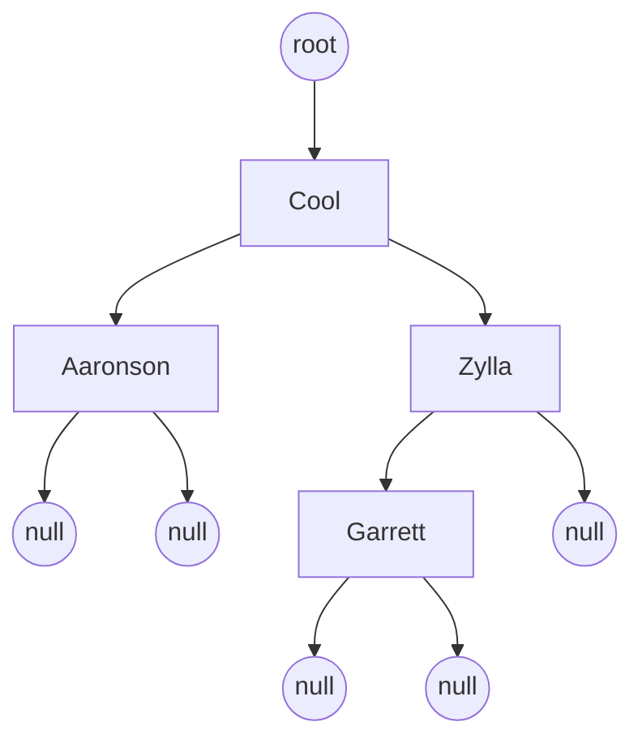
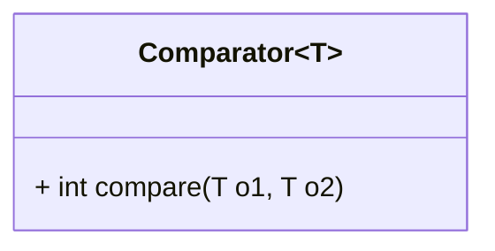

# Übungsblätter
Alle Übungsblätter mit Aufgaben aus den Modulen "Programmieren 1" und "Programmieren 2", die an der Technischen Hochschule Würzburg-Schweinfurt angeboten werden.

## Programmieren 1

### Übungsblatt 1
#### Aufgabe 1: (0 Punkte)
Installieren Sie auf Ihrem eigenen Computer/Notebook das Java Development Kit (JDK) von Oracle. Ergänzen Sie die Umgebungsvariable PATH um das bin-Verzeichnis der JDK Installation. Rufen Sie ein Konsolenfenster auf, z. B. Start -> Ausführen -> cmd und testen Sie die Befehle javac und java. Wenn beide Befehle ausgeführt wurden, haben Sie das JDK richtig konfiguriert.

#### Aufgabe 2: (2 Punkte)
Erstellen Sie eine Datei Application.java, die bei Ausführung "Willkommen zu Programmieren 1" ausgibt.
- Übersetzen und starten Sie das Programm auf der Konsole! Dokumentieren Sie stichpunktartig die dazu notwendigen Schritte! (1 Punkt)
- Übersetzen und starten Sie das Programm mit Eclipse! Dokumentieren Sie stichpunktartig die dazu notwendigen Schritte! (1 Punkt)

#### Aufgabe 3: (1 Punkt)
Schreiben Sie ein Programm, welches folgenden Term korrekt berechnet und das Ergebnis ausgibt: $3 * (9 + 3) + 4 * 8$

### Übungsblatt 2
#### Aufgabe 1: (1 Punkt) 
Gegeben sei folgendes Programm:
```java
public class Tausch {
    public static void main(String[] args) {
        int x = 5;
        int y = 7;

        // Vor dem Tausch
        System.out.println(x);
        System.out.println(y);

        // Tausch
        int temp = x;
        x = y;
        y = temp;

        // Nach dem Tausch
        System.out.println(x);
        System.out.println(y);
    }
}
```
Tauschen Sie die Inhalte der beiden Variablen, d. h. wenn vor dem Tausch x den Wert 5 hatte und y den Wert 7, dann soll x nach dem Tausch den Wert 7 haben und y den Wert 5. Führen Sie den Tausch so durch, dass der Tausch funktioniert, egal mit welchem Wert x und y initialisiert werden.

#### Aufgabe 2: (1 Punkt)
Schreiben Sie ein Programm, das – bei gegebenem Radius r eines Kreises – die Kreisfläche $(πr^2)$ und den Kreisumfang $(2πr)$ berechnet und auf der Standardausgabe mit Hinweistext ausgibt. Wie groß wäre das Volumen, falls es sich statt eines Kreises um eine Kugel $(\frac{4}{3}πr^3)$ handelt? Berechnen Sie das Volumen und geben Sie es aus! Sie können die Kreis- und die Kugelberechnungen im gleichen Programm stattfinden lassen.

#### Aufgabe 3: (1 Punkt)
Zur Lösung quadratischer Gleichungen der Form $x^2 + px + q = 0$ wird die pq-Formel verwendet:
```math
x_{1,2} = - \frac{p}{2} \pm \sqrt{\left( \frac{p}{2} \right)^2 - q}
```
Schreiben Sie ein Programm, das bei Angabe der Variablen p und q die beiden Lösungen für x ausrechnet! Recherchieren Sie mit einer Suchmaschine, mit welchem Befehl in Java eine Wurzel gezogen werden kann.

#### Aufgabe 4: (1 Punkt)
Schreiben Sie ein Programm, das die Variablen „stunden“, „minuten“ und „sekunden“ enthält. Initialisieren Sie die Variablen mit der aktuellen Uhrzeit.
- Berechnen Sie die Anzahl der Sekunden seit Mitternacht und geben Sie diese aus!
- Berechnen Sie die Anzahl der verbleibenden Sekunden für diesen Tag und geben Sie diese aus!
- Berechnen Sie, wie viel Prozent des Tages schon vergangen sind und geben Sie das Ergebnis aus! Die Prozentangabe soll auf mehrere Nachkommastellen genau angegeben werden.

### Übungsblatt 3
#### Aufgabe 1: (Modulo) (1 Punkt)
Schreiben Sie ein Programm, welches vom Benutzer eine ganze Zahl einliest und mithilfe des Modulo-Operators überprüft, ob die Zahl durch 7 teilbar ist. Anschließend soll eine entsprechende Ausgabe auf der Standardausgabe erfolgen. Was passiert, wenn der Modulo Operator auf negative Zahlen angewendet wird? Schreiben Sie die zugehörige Vorzeichentabelle auf.

#### Aufgabe 2: (Pizzarechner) (1 Punkt)
Auf einer Pizzakarte werden Pizzen oft in unterschiedlichen Durchmessern (26cm, 28cm, 30cm) zu unterschiedlichen Preisen angeboten. Schreiben Sie ein Programm, das von zwei Pizzen jeweils den Durchmesser und den Preis einliest. Das Programm soll die Fläche der Pizza ausrechnen und daraufhin ausgeben, welche Pizza das bessere Größen-/Preisverhältnis hat. Vorgehensweise: Belegen Sie zunächst die Variablen mit festen Werten und implementieren Sie die Berechnung und die Ausgabe. Wenn alles soweit läuft, fügen Sie das Einlesen der Werte hinzu. So müssen Sie nicht bei jedem Testlauf erneut die Werte eingeben.

#### Aufgabe 3: (Einzelzeichen) (1 Punkt)
Schreiben Sie ein Programm, das ein Einzelzeichen einliest. Ist das Einzelzeichen 
- ein Großbuchstabe, soll das Wort "Großbuchstabe" ausgegeben werden.
- eine hexadezimale Ziffer (d.h. '0' – '9', 'a' – 'f'  oder  'A' – 'F'), dann soll „Hexadezimale Ziffer“ ausgegeben werden.
- eine binäre Ziffer, dann soll "binäre Ziffer" ausgegeben werden.
- eine Ziffer im Oktalsystem, dann soll "oktale Ziffer" ausgegeben werden.

Fällt ein Einzelzeichen in mehrere Kategorien, sollen alle passenden Ausgaben erscheinen. Fällt ein Einzelzeichen in keine der Kategorien, soll die Ausgabe „Unbekannt“ erfolgen.

#### Aufgabe 4: (Würfelwurf) (1 Punkt)
Der Befehl Math.random() gibt eine zufällige Double-Zahl zwischen 0 (inklusive) und 1 (exklusive) zurück. Für eine zurückgegebene Zahl x gilt also 𝑥 ∈ [0..1). Simulieren Sie den Wurf eines 6-seitigen Würfels. Wenn eine 1 gewürfelt wurde, soll der Text "Eins gewürfelt" ausgegeben werden, bei einer 2 "Zwei gewürfelt", etc.

### Übungsblatt 4
#### Aufgabe 1: (Freier Fall) (1 Punkt)
Die zurückgelegte Strecke eines frei fallenden Körpers berechnet sich nach folgender Formel: $s(t) = \frac{1}{2} g * t^2$, wobei g die Fallbeschleunigung $(9.80665 \frac{m}{s^2})$ und t die vergangene Zeit in Sekunden darstellt. Schreiben Sie ein Programm, welches die zurückgelegte Strecke im Sekundentakt, wie im Beispiel gezeigt, ausgibt. Die Falldauer soll vom Benutzer eingegeben werden.

Beispiel:  
> Bitte Falldauer in Sekunden eingeben: 8  
> Zeit: 1 Sekunden: Zurückgelegte Strecke: 4.903325 m  
> Zeit: 2 Sekunden: Zurückgelegte Strecke: 19.6133 m  
> ...  
> Zeit: 8 Sekunden: Zurückgelegte Strecke: 313.8128 m  

Modifizieren Sie das Programm, so dass nur für jede fünfte Sekunde eine Ausgabe erfolgt! Beginnen Sie bei der Ausgabe mit der ersten Sekunde, gefolgt von der sechsten Sekunde.

#### Aufgabe 2: (Reihenberechnung) (1 Punkt)
Gegeben sei folgende Reihe:
```math
6 * \sum_{k=1}^\infty \frac{1}{k^2}
```
Schreiben Sie die ersten fünf Glieder der Reihe auf Papier auf Ihrer schriftlichen Lösung auf! Schreiben Sie ein Programm, welches die Reihe berechnet und das Ergebnis bei jedem Schleifendurchlauf ausgibt. Brechen Sie die Berechnung ab, wenn die Änderung des Reihenwertes in einem Schleifendurchlauf kleiner als $10^{-5}$ ist.

#### Aufgabe 3: (Das kleine Einmaleins) (1 Punkt)
Schreiben Sie ein Programm, welches das kleine 1x1 ausgibt. Hinweis: Beginnen Sie damit zunächst die ersten zehn Produkte mit Hilfe einer Schleife auszugeben, d.h. 1x1=1, 1x2=2, … 1x9=9, 1x10=10.

Ausgabe:  
> 1 x 1 = 1  
> 1 x 2 = 2  
> 1 x 3 = 3  
> ...  
> 2 x 1 = 2  
> 2 x 2 = 4  
> 2 x 3 = 6  
> ...  
> 10 x 8 = 80  
> 10 x 9 = 90  
> 10 x 10 = 100  

#### Aufgabe 4: (Primzahlen) (1 Punkt)
Schreiben Sie ein Programm, welches für eine vom Benutzer eingegebene ganze Zahl ermittelt, ob diese eine Primzahl ist.

Beispiel 1:
> Bitte zu untersuchende Zahl eingeben: 47  
> Untersuchte Zahl ist eine Primzahl

Beispiel 2:
> Bitte zu untersuchende Zahl eingeben: 51  
> Untersuchte Zahl ist keine Primzahl

### Übungsblatt 5
#### Aufgabe 1: (Temperaturtabelle) (1 Punkt)
Schreiben Sie ein Programm namens Temperaturumwandlung, das eine Temperaturtabelle auf dem Bildschirm gemäß der Formel $Grad \\ Celsius = \frac{5}{9} * (Grad \\ Fahrenheit - 32)$ ausgibt. Die Temperaturtabelle soll in der ersten Spalte Temperaturwerte in Fahrenheit (als ganze Zahl von 0 Grad Fahrenheit bis 300 Fahrenheit, jeweils inklusive) enthalten und in der zweiten Spalte die entsprechenden Temperaturwerte in Celsius (vom Typ float) auf zwei Nachkommastellen abgeschnitten oder gerundet.

| Fahrenheit | Celsius |
| ---:       | ---:    |
| 0          | -17.77  |
| 1          | -17.22  |
| 2          | -16.66  |
| ...        | ...     |
| 299        | 148.33  |
| 300        | 148.88  |

Die Spalten sollen durch ein Tabulatorzeichen getrennt werden, ansonsten muss die Tabelle nicht formatiert sein.

#### Aufgabe 2: (Querprodukt) (1 Punkt)
Schreiben Sie ein Programm namens Querprodukt, welches das "Querprodukt" einer int-Zahl berechnet und dieses mit einer Meldung am Bildschirm anzeigt. Die int-Zahl soll von der Standardeingabe solange eingelesen werden, bis sie gültig ist (zwischen 0 und einer Million, jeweils inklusive). Bei Eingabe einer ungültigen int-Zahl soll zusätzlich eine Fehlermeldung erscheinen und ein erneutes Einlesen erfolgen.

Beispiel:  
> Geben Sie bitte eine Zahl ein: -3  
> FEHLER – Zahl ist ungültig.  
> Geben Sie bitte eine Zahl ein: 1348213  
> FEHLER – Zahl ist ungültig.  
> Geben Sie bitte eine Zahl ein: 3225  
> Das Querprodukt der Zahl 3225 beträgt 60  

#### Aufgabe 3: (Modellierung) (1 Punkt)
Modellieren Sie schriftlich mit einem Struktogramm oder einem Aktivitätsdiagramm die Querproduktaufgabe!

#### Aufgabe 4: (Potenz) (1 Punkt)
Schreiben Sie ein Programm das die Potenz $a^b$ berechnet und das Ergebnis auf der Standardausgabe anzeigt. Sowohl die Basis $(a)$, als auch der Exponent $(b)$ werden über die Standardeingabe (a vom Typ double, b vom Typ int) eingelesen. In Abhängigkeit vom Exponenten $(b)$ gilt für $a^b$:
```math
\begin{align*}
b > 0 &: a^b = \overbrace{a * a * a * ... * a}^{b-mal} \\
b = 0 &: a^0 = 1 \\
b < 0 &: a^b = \frac{1}{\underbrace{a * a * a * ... * a}_{b-mal}}
\end{align*}
```
Bei dieser Aufgabe darf die Klasse Math und deren Methoden nicht verwendet werden.

### Übungsblatt 6
#### Aufgabe 1: (π-Rechtecknäherung) (1 Punkt)
Schreiben Sie ein Programm, das die Zahl π mittels der in der Vorlesung besprochenen Rechtecknäherung annähert. Der Benutzer soll die Anzahl der zu verwendenden Rechtecke eingeben können.

#### Aufgabe 2: (Runden) (1 Punkt)
Schreiben Sie eine Methode, die eine übergebene Zahl auf- oder abrundet. Beispiele: 3,2 wird auf 3 abgerundet, 3,5 auf 4 aufgerundet. Schreiben Sie eine weitere Methode, welche eine übergebene Zahl auf eine bestimmte Anzahl Nachkommastellen rundet. Die Anzahl der Nachkommastellen soll anhand eines zusätzlich übergebenen Parameters bestimmt werden können.

Hinweis: Die Verwendung sämtlicher Methoden aus der Klasse Math ist untersagt!

#### Aufgabe 3: (Fakultät) (1 Punkt)
Schreiben Sie eine Methode, welche die Fakultät mit Hilfe einer Schleife (nicht rekursiv) berechnet. Testen Sie die Methode, indem Sie ein Programm schreiben, das vom Benutzer eine Zahl einliest und ihre Fakultätsmethode aufruft.

#### Aufgabe 4: (Dreieck) (1 Punkt)
Schreiben Sie eine Methode, die ein Dreieck aus Sternen ausgibt. Die Methode soll ein Argument entgegennehmen, das festlegt, wie viele Zeilen ausgegeben werden sollen. In der rechten Abbildung sehen Sie eine Beispielausgabe für 5 Zeilen. Beachten Sie bitte, dass zwischen den einzelnen Sternen ein Leerzeichen ausgegeben wird.

Hinweis: Versuchen Sie zunächst das Dreieck in der linken Abbildung auszugeben. Passen Sie dann Ihr Programm so an, dass das Dreieck auf der rechten Seite herauskommt!

| Linkes Dreieck                                    | Rechtes Dreieck                                   |
| :---                                              | :----:                                            |
| * <br> * * <br> * * * <br> * * * * <br> * * * * * | * <br> * * <br> * * * <br> * * * * <br> * * * * * |

### Übungsblatt 7
#### Aufgabe 1: (Rekursion) (1 Punkt)
Schreiben Sie eine Methode, die $x^n$ rekursiv berechnet! Testen Sie ihre Methode, indem vom Anwender die Basis und der Exponent erfragt und eingegeben werden. Anschließend wird die Methode aufgerufen und das Ergebnis auf der Standardausgabe angezeigt.

Hinweis: Machen Sie sich hierbei die mathematische Definition der Potenz zunutze: $x^0 = 1$, $x^{n+1} = x^n * x$, wobei $x \in \mathbb{R}, n \in \mathbb{N}$.

#### Aufgabe 2: (Sinusberechnung) (1 Punkt)
Schreiben Sie eine Methode, die den Sinus berechnet. Der Sinus kann durch folgende Reihe berechnet werden:
```math
\sin(x) = \sum_{k=0}^{\infty} (-1)^k \frac{x^{2k+1}}{(2k + 1)!}
```
Schreiben Sie zunächst die ersten fünf Glieder der Summe auf! Testen Sie ihre Methode, indem vom Anwender der Wert x abgefragt und eingegeben wird. Anschließend wird die Methode aufgerufen und das Ergebnis auf der Standardausgabe angezeigt.

Hinweis: Gehen Sie analog zu der Berechnung des Cosinus im Vorlesungsskript vor.

#### Erklärung zu den Aufgaben 3 und 4:
In der Statistik gibt es wichtige Größen zur Beurteilung von Messreihen. Die beiden vielleicht bedeutendsten Größen sind der Mittelwert (arithmetisches Mittel) und die Standardabweichung. Das arithmetische Mittel $\bar{x}$ wird durch folgende Formel bestimmt:
```math
\bar{x} = \frac{1}{n} \sum_{i=1}^{n} x_i
```

Beispiel: 

> | Note   | 1      | 2      | 3      | 4      | 5      |
> | :---   | :----: | :----: | :----: | :----: | :----: |
> | Anzahl | 2      | 3      | 5      | 2      | 3      |
> 
> Der Notenspiegel von 15 Schülern ist oben abgebildet. Das arithmetische Mittel (Durchschnittsnote) berechnet sich wie folgt: $\frac{2 * 1 + 3 * 2 + 5 * 3 + 2 * 4 + 3 * 5}{15} \approx 3.07$

Die Standardabweichung $s'$ ist ein Maß für die Streuung um den Mittelwert und berechnet sich wie folgt:
```math
s' = \sqrt{\frac{1}{n} \sum_{i=1}^{n} (x_i - \bar{x})^2}
```

#### Aufgabe 3: (Arithmetisches Mittel, Maximum, Minimum) (1 Punkt)
Schreiben Sie ein Programm, das eine Messreihe (d. h. eine beliebige Anzahl von Fließkommazahlen) einliest, die vom Anwender eingegeben werden. Die Anzahl ist zu Beginn vom Benutzer einzugeben und muss größer als 0 sein. Ansonsten terminiert das Programm mit einer Fehlermeldung. Ausgegeben werden soll am Ende das arithmetische Mittel der eingegebenen Zahlen, sowie der kleinste (Minimum) und der größte (Maximum) Wert.

Beispiel:
> Anzahl der einzulesenden Werte: 5
> 1. Wert:  3,14
> 2. Wert:  2,67
> 3. Wert:  6,71
> 4. Wert:  1,45
> 5. Wert:  5,23
> 
> Kleinster Wert: 1.45  
> Groesster Wert: 6.71  
> Arithmetischer Mittelwert: 3.84

Testen Sie ihr Programm mit den Werten aus obigem Szenario.

#### Aufgabe 4: (Standardabweichung) (1 Punkt)
Ergänzen Sie Ihr Programm aus Aufgabe 3 um die Berechnung der Standardabweichung.

### Übungsblatt 8
#### Aufgabe 1: (Lottoziehung) (1 Punkt)
Schreiben Sie ein Programm, das die Ziehung der Lottozahlen simuliert, die Zahlen in einem Feld ablegt und anschließend die gezogenen Lottozahlen nach dem in der Vorlesung vorgestellten Sortier-Verfahren sortiert. Es dürfen keine doppelten Lottozahlen vorliegen. Die sortierten Lottozahlen sollen anschließend ausgegeben werden.

Hinweis: Die Verwendung von Sortier-Methoden aus der Java-Bibliothek ist untersagt!

#### Aufgabe 2: (Array) (1 Punkt)
Kinder spielen gerne das B-Sprachen-Spiel. Die B-Sprache funktioniert so, dass an jeden Vokal (a,e,i,o,u) eines Wortes ein b plus die Wiederholung des Vokals angefügt wird. Schreiben Sie eine Methode namens spielen, die ein normales Wort entgegennimmt (Parameterdatentyp: String) und in ein Wort der B-Sprache übersetzt und dieses zurückgibt.

Beispiel:
> übergebene Zeichenfolge: spiel mit mir  
> zurückgelieferte Zeichenfolge: spibiebel mibit mibir

Hinweise:
- Verwenden Sie zur Lösung der Aufgabe keine Methoden der Klasse String außer `toCharArray()` und `String.valueOf()`!
- Wandeln Sie den an die Methode übergebenen String mit `toCharArray()` in ein char-Array um!
- Ermitteln Sie, wie lang der zurückzugebende String sein muss und erzeugen Sie ein neues char-Array der entsprechenden Länge.
- Speichern Sie in diesem char Array das Wort der B-Sprache.
- Wandeln Sie das neue char-Array mit `String.valueOf()` zurück in einen String um und geben Sie diesen zurück.

#### Aufgabe 3: (Parameterübergabe durch Kommandozeile) (1 Punkt)
Schreiben Sie ein Programm, dem bei Programmstart zwei Zahlen auf der Kommandozeile/Eingabeaufforderung als Argumente übergeben werden. Die Zahlen sollen dann miteinander multipliziert werden und das Ergebnis ausgegeben werden. Überprüfen Sie, ob genau zwei Argumente bei Programmstart mitgegeben werden, ansonsten soll eine aussagekräftige Fehlermeldung angezeigt werden.

#### Aufgabe 4: (Galgenmännchen) (1 Punkt)
Entwickeln Sie das Spiel Galgenmännchen. Der Benutzer soll eines von 20 im Programm vordefinierten Wörtern als Unterstriche angezeigt bekommen.

Beispiel:
> Im Programm wurde das Wort „PROGRAMMIERSPRACHE“ ausgewählt, der Benutzer bekommt folgende Anzeige:
> 
> 1. Versuch: _ _ _ _ _ _ _ _ _ _ _ _ _ _ _ _ _ _
> 
> Jetzt darf er einen Buchstaben eingeben. Groß- und Kleinschreibung soll nicht unterschieden werden. Bei jeder Eingabe wird die Anzahl der Versuche hochgezählt. Wenn er also ein ‚z‘ eingibt, erfolgt folgende Ausgabe:
> 
> 2. Versuch: _ _ _ _ _ _ _ _ _ _ _ _ _ _ _ _ _ _
> 
> Gibt er einen Buchstaben ein, der im Wort vorhanden ist, wird jedes Vorkommen des Buchstabens angezeigt. Gibt bspw. der Benutzer ein ‚m‘ ein:
> 
> 3. Versuch: _ _ _ _ _ _ M M _ _ _ _ _ _ _ _ _
> 
> Nach dem 15. Versuch oder wenn das Wort komplett erraten wurde, sollen keine weiteren Eingaben erfolgen und das Programm abbrechen.

Hinweis: Mit der Methode `toCharArray()` kann ein String in ein char[] umgewandelt werden: 
```java
String sentence = … 
char[] chars = sentence.toCharArray();
```

### Übungsblatt 9
#### Aufgabe 1: (1 Punkt) (Klassen, Objekte)
Schreiben Sie eine Klasse Auto, die folgende Eigenschaften aus der Realität abbildet:
- Marke (VW, BMW, Audi,...)
- Hubraum
- Farbe
- Weitere Merkmale, die Sie als wichtig erachten.

Schreiben Sie weiterhin eine Klasse, in der Sie Ihre drei Lieblingsautos anlegen, d.h., erstellen Sie drei Instanzen/Objekte der Klasse Auto und setzen Sie deren Attribute sinnvoll. Ermitteln Sie das Auto mit dem größten Hubraum von den dreien (ohne das Wissen, welches Sie aus der Erstellung der Objekte besitzen), und geben Sie die Daten dieses Autos aus!

#### Aufgabe 2: (1 Punkt) (Konstruktor)
Ergänzen Sie in der Klasse Auto einen Konstruktor, der es erlaubt, alle Attribute direkt bei der Erstellung des Objekts mitanzugeben. Schreiben Sie eine Methode `setHubraum(int ccm)`, die es erlaubt, von einer anderen Klasse aus, den Hubraum zu setzen. Stellen Sie sowohl im Konstruktor als auch in der Methode `setHubraum(int ccm)` sicher, dass der übergebene Hubraum gültig (größer als 0) ist. Im Konstruktor soll im ungültigen Fall der Hubraum auf 1600 gesetzt werden. In der Methode `setHubraum(int ccm)` soll im ungültigen Fall der bisherige Wert nicht verändert werden.

#### Aufgabe 3: (1 Punkt)(Pizza)
Erweitern Sie das Pizzabeispiel aus der Vorlesung, so dass eine Pizza mehrere beliebige Durchmesser/Preiskombinationen haben kann. Erstellen Sie dabei auch einen passenden Konstruktor. Schreiben Sie eine weitere Klasse, in der 5 Pizzen angelegt werden! Die Ausgabe der Speisekarte ist nicht gefordert!

| Nummer | Name            | 26 cm  | 32 cm | 50 cm |
| :---   | :---            | ---:   | ---:  | ---:  |
| 33.    | Pizza Ananas    | 4.00   | 5.50  | 10.00 |
| 34.    | Pizza Sucuk     | 4.00   | 5.50  | 10.00 |
| 35.    | Pizza Spaghetti | 4.00   | 5.50  | 10.00 |
| 46.    | Pizza Pollo     | 4.00   | 5.50  | 10.00 |
| 47.    | Pizza Sardelle  | 4.00   | 5.00  | 10.00 |
| 48.    | Pizza Scampi    | 5.00   | 7.00  | 12.00 |
| 49.    | Pizza Spinaci   | 4.00   | 5.00  | 10.00 |
| 50.    | Margherita      | 3.00   | 4.00  | 10.00 |
| 51.    | Pizza Cipolla   | 3.50   | 4.50  | 10.00 |
| 52.    | Pizza Schinken  | 3.50   | 4.50  | 10.00 |

#### Aufgabe 4: (1 Punkt) (einfacher Rechner)
Schreiben Sie ein Programm, das beliebig viele Zahlen als Programmparameter übergeben bekommen kann. Zusätzlich wird als letztes Zeichen ein "+" oder "-" übergeben. Lesen Sie alle Parameter ein und führen Sie eine Addition bzw. eine Subtraktion auf alle übergebenen Zahlen aus. Bei einer Subtraktion soll von der ersten Zahl subtrahiert werden. Sie können davon ausgehen, dass immer mindestens zwei Zahlen übergeben werden und dass nur die Operatoren + und - übergeben werden.

Beispiel:
> java Parameterübergabe 1 2 3 +  
> Ausgabe des Programms ist 6 $(= 1 + 2 + 3)$
> 
> java Parameterübergabe 10 2 3 –  
> Ausgabe des Programms ist 5 $(= 10 - 2 - 3)$

### Übungsblatt 10 (bzv-relevant)
#### Aufgabe 1: (1 Punkt) (Produktionszähler)
Erweitern Sie die Klasse Auto (Übungsblatt 9 / Aufgabe 1 und 2) um eine static Variable, mit deren Hilfe die Anzahl der produzierten Autos gezählt wird. Schreiben Sie weiterhin eine Klassenmethode `berechneUmsatz(int durchschnittspreis)`, welche anhand des übergebenen durchschnittlichen Verkaufspreises den Bruttoumsatz der Fahrzeugproduktion berechnet und diesen zurückliefert.

#### Aufgabe 2: (1 Punkt) (Raum)
Schreiben Sie eine Klasse Raum. Ein Raum hat eine Kennung, die ihn identifiziert (z.B. I.2.1), und kann eine maximale Anzahl an Studenten für eine Vorlesung beherbergen. Ferner soll ein Raum (für eine Vorlesung/Übung) belegbar sein und darüber Auskunft geben können, ob er gerade belegt ist oder nicht.

Schreiben Sie eine main-Methode, die zwei Räume anlegt, den Raum I.2.1 und den Raum I.2.15, mit der jeweils maximalen Zahl der Studenten, die in den Raum passen. Danach soll die Methode abfragen, ob die Räume belegt sind. Im letzten Schritt soll der Raum I.2.1 belegt werden und nochmals beide Räume befragt werden, ob sie belegt sind. Setzen Sie bei der Aufgabe das Prinzip des Information Hidings um!

Hinweis: Ob ein Raum belegbar ist oder nicht, lässt sich über eine bool’sche Variable darstellen.

#### Aufgabe 3: (1 Punkt) (Raum und Vorlesung)
Erweitern Sie Ihr Programm aus Aufgabe 2, um eine Klasse Vorlesung. Eine Vorlesung soll einen Namen haben, von einem Dozenten gehalten werden und einem Studiengang zugeordnet sein. Wenn ein Raum belegt wird, dann soll er mit einer bestimmten Vorlesung (also einem Objekt der Klasse Vorlesung) belegt werden. Wenn der Raum nach seiner Belegung gefragt wird, soll er die Vorlesung zurückgeben, mit der er gerade belegt ist. Wenn der Raum frei ist, soll er null zurückgeben.

#### Aufgabe 4: (1 Punkt) (Raum und Studenten)
An einer Hochschule, die in dieser Aufgabe nicht genannt werden möchte, sind alle Studenten mit einer Chipkarte ausgerüstet, die es zu jeder Zeit erlaubt, den Studierenden zu orten. Diese Information soll benutzt werden, um festzustellen, welche Studenten zu einem bestimmten Zeitpunkt in einem Raum sind.

Ergänzen Sie die Klasse Raum (aus Aufgabe 2) so, dass er Studenten erfassen kann, und zwar maximal gemäß seiner Kapazität. Immer wenn ein Student einen Raum betritt, soll der Raum den Studenten abspeichern. Wenn der Student den Raum verlässt, soll er den Studenten wieder entfernen.

Vorgehensweise: Ergänzen Sie im Raum als Attribut ein Array von Studenten. Erweitern Sie den Raum, um eine Methode `betreteRaum()`, und übergeben Sie beim Aufruf der Methode den Studenten, der den Raum betritt, und speichern Sie ihn im Array. Gehen Sie analog für eine Methode `verlasseRaum()` vor.

Schreiben Sie ein Testprogramm, das den Raum mit Studenten belegt, alle Studenten, die zum Zeitpunkt der Abfrage im Raum sind, ausgibt, und dann die Studenten wieder den Raum verlassen lässt.

### Übungsblatt 11
#### Aufgabe 1: (Ausweis)
Schreiben Sie die Klasse Ausweis mit den Attributen Vorname, Nachname und Geschlecht. Neben einem parameterbehaftetem Konstruktor soll die Kasse die entsprechenden getter- und setter-Methoden besitzen. Weiterhin soll die Klasse die Methode `toString()` überschreiben, welche die Inhalte der Instanzattribute auf der Standardausgabe anzeigt. Erzeugen Sie zwei weitere Klassen Studentenausweis und Vereinsausweis, welche von der Klasse Ausweis abgeleitet sind, und weitere klassenspezifische Attribute besitzen. Weiterhin soll die geerbte Methode `toString()` in den Subklassen geeignet überschrieben werden.

Schreiben Sie eine Methode namens `erzeugeAusweise`, welche ein Feld erzeugt, in dem gleichzeitig bis zu 6 Instanzen von der Klasse Ausweis, Studentenausweis oder Vereinsausweis abgelegt werden können. Das Feld soll 2 Instanzen der Klasse Ausweis, 2 Instanzen der Klasse Studentenausweis und 2 Objekte der Klasse Vereinsausweis beinhalten. Der Rückgabewert der Methode ist das innerhalb der Methode erzeugte Feld.

Schreiben Sie eine private Methode namens `datenAusgabe`, welcher als Parameter ein Feld unbekannter Länge übergeben wird, in dem Objekte der Klasse Ausweis, Studentenausweis oder Vereinsausweis abgelegt sind. Im Rumpf der Methode sollen die Daten aller im Feld enthaltenen Objekte ausgegeben werden. Beachten Sie, dass nicht alle Feldelemente im übergebenen Feld zwingend belegt sein müssen. Für den Fall, dass Feldelemente nicht belegt sind, ist eine entsprechende Meldung in der Form: „Dieser Index \<index\> ist nicht belegt“ mit Angabe des Feldindex auszugeben.

#### Aufgabe 2: (Uhrzeit)
Schreiben Sie eine Klasse namens Uhr, die die Uhrzeit (24-Stunden, Minuten, Sekunden) verwaltet und folgende Methoden enthält:

- `Uhr(int std, int min, int sek)`: Ist einziger Konstruktor. Setzt die Uhrzeit auf die angegebenen Paramter. Falls mind. einer der Parameter ungültig ist, soll die Uhrzeit auf genau 12:00:00 gesetzt werden.
- `int getStd()`: Liefert die Stunden der Uhrzeit zurück
- `int getMin()`: Liefert die Minuten der Uhrzeit zurück
- `int getSek()`: Liefert die Sekunden der Uhrzeit zurück 
- `void setUhr(int std, int min, int sek)`: Setzt die Uhrzeit auf die angegebenen Parameter. Falls einer der Paramter ungültig ist, soll eine Fehlermeldung ausgegeben werden und die original Uhrzeit unverändert bleiben.
- `void naechsteSek()`: Zählt die Uhrzeit um 1 Sekunde hoch.
- `long getTagesSek()`: Liefert die Uhrzeit (seit Mitternacht) komplett in Sekunden zurück.
- `boolean wecker(Uhr weckzeit)`: Überprüft, ob die Uhrzeit mit der Zeit von weckzeit übereinstimmt.

Vereinbaren Sie ein Feld `weltzeit` für 24 verschiedene Uhren. Erzeugen Sie anschließend als eigenständige Anweisung(en) 24 verschiedene Uhren für dieses Feld und initialisieren Sie die erste Uhr im Feld mit der Uhrzeit 00:23:07, die zweite Uhr mit 01:23:07, usw. bis 23:23:07.

Wie sieht die Schleife aus, um im Feld `weltzeit` aus vorheriger Teilaufgabe jede der 24 Uhrzeiten um 1 Sekunde hoch zu zählen?

#### Aufgabe 3: (Bahn-Modellierung)
Bei der Deutschen Bahn fahren verschiedene Zugtypen. Alle Zugtypen sollen über eine Lok und eine bestimmte Anzahl Wagons verfügen. Ein Wagon für Güter hat i.d.R. ein Fassungsvermögen und transportiert eine bestimmte Art an Gütern, z.B. Autos, Gefahrengut, o.ä. In einem Personenzug gibt es verschiedene Arten von Wagons: ein Bordbistro, ein Wagon für Passagiere und den Fahrradwagen. Hier hat jeder Wagon eine Anzahl Sitzplätze. In den ICEs und ICs können zusätzlich sogar Sitzplatzreservierungen durchgeführt werden.
- Entscheiden Sie, welche Klassen inkl. Attribute Sie benötigen, um dieses Problem in einem Java Programm abzubilden.
- Zeichnen Sie ein Diagramm, in welchem die Beziehungen (Vererbung, Komposition, Aggregation, Assoziation) zwischen den Klassen inkl. ihrer Attribute gezeigt werden.

#### Aufgabe 4: (Bahn-Implementierung)
Schreiben Sie ein Java Programm, mit dem ein Benutzer selbst einen Zug (modelliert in Aufgabe 3) zusammensetzen kann. D.h. der Benutzer soll in einem Menü wiederholt auswählen, welchen Wagon er als nächstes an den Zug anhängen möchte, z. B.:
> 1:  Lok hinzufügen  
> 2: Passagierwagon hinzufügen  
> 3: Fahrradwagen hinzufügen  
> 4: Güterwagen hinzufügen  
> 5: Bordbistro hinzufügen  
> 6: fertig

Hinweis: Sie haben sowohl bei der Modellierung (Aufgabe 3) als auch bei der Implementierung (Aufgabe 4) einen größeren Freiheitsgrad!

## Programmieren 2

### Übungsblatt 12
#### Aufgabe 1: (Vererbung: Generalisierung)
Schreiben Sie eine abstrakte Klasse `Person` mit der abstrakten Methode `gibTaetigkeitAus()`, die die Tätigkeit der Person auf die Konsole ausgeben soll. Leiten Sie die konkreten Klassen `Student` und `Professor` ab. Erzeugen Sie ein Feld von 100 Personen, abwechselnd Student und Professor. Rufen Sie bei allen 100 Personen die Methode `gibTaetigkeitAus()` auf. 

> Bei einem Studenten soll folgende Ausgabe erfolgen: "Der Student studiert."  
> Bei einem Professor soll folgende Ausgabe erfolgen: "Der Professor lehrt."

#### Aufgabe 2: (Vererbung: Generalisierung)
Schreiben Sie ein Programm, das einen Quizbogen für einen Nutzer als Text generiert. Ein Quiz soll aus zwei Arten von Quizfragen bestehen:
- Textfragen, die ein einzelnes Wort als richtige Antwort haben. Eine Textfrage könnte wie folgt auf dem Quizbogen erscheinen:
  > Fragentext: "Was ist die Hauptstadt von Deutschland?"  
  > Antwort: <Zwei Leerzeilen für eine Antwort>
- Multiple-Choice Fragen, die ein Array von möglichen Antworten speichern. Eine Multiple-Choice Frage könnte wie folgt auf dem Quizbogen erscheinen:
  > Fragentext: "Wie viele Protonen hat ein Wasserstoff-Atom?"  
  > Antwortmöglichkeiten: A: 4 B: 2 C: 1 D: 0

Legen Sie ein Quiz mit mehreren Text- sowie Multiple-Choice Fragen an und generieren Sie einen Quizbogen.

#### Aufgabe 3: (Vererbung: Spezialisierung)
Schreiben Sie ein Programm, das die Struktur eines Unternehmens abbildet. In dem Unternehmen gibt es mehrere Abteilungen. In jeder Abteilung arbeiten mehrere Angestellte und ein Abteilungsleiter. Ein Angestellter soll einen Nachnamen, Vornamen, einen Identifikator, ein Grundgehalt, einen Gehaltsfaktor sowie ein Geburtsdatum haben. Für alle Attribute sollen Getter- und Setter zur Verfügung stehen. Der Gehaltsfaktor für einen Angestellten ist 1. Das Gehalt errechnet sich aus dem Gehaltsfaktor multipliziert mit dem Grundgehalt. Ein Abteilungsleiter soll ein Angestellter sein und ebenfalls einen Nachnamen, Vornamen, einen Identifikator, ein Grundgehalt, einen Gehaltsfaktor sowie ein Geburtsdatum haben. Der Gehaltsfaktor beträgt bei einem Abteilungsleiter 2. Ferner soll ein Abteilungsleiter eine Methode `befördern` haben, in der ein Angestellter befördert werden kann. Dieser Angestellte soll dann seinen Gehaltsfaktor um 10% erhöht bekommen. Schreiben Sie eine geeignete main-Methode, um Ihr Programm zu testen.

#### Aufgabe 4: (Vererbung: Spezialisierung)
Verwenden Sie die vorgegebenen Klassen `SimpleChangeCalculator` und `Coin`. 
```java
/**
 * Die Klasse SimpleChangeCalculator beinhaltet einen sehr einfachen Algorithmus zur Ermittlung des Wechselgelds:
 * Es wird der gesamte Betrag in 1-Cent-Münzen ausgegeben.
 */
public class SimpleChangeCalculator {
    
    /**
     * Mit Hilfe des Rückgabewerts der Methode getChange wird der Münzausgabemechanismus des Automaten gesteuert.
     * An der Stelle 0 des Arrays steht, wie viele 1-Cent-Münzen ausgegeben werden sollen.
     * An der Stelle 1, wie viele 2-Cent-Münzen. Das geht bis zu den 2-Euro-Münzen an der Stelle 7.
     * Der Aufrufer darf keine negativen Werte uebergeben.
     * Der Cent-Parameter darf keinen Wert > 99 annehmen.
     */
    public int[] getChange(int euros, int cent) {
        return new int[] {
            euros * 100 + cent, // alles in 1-Cent-Münzen
            0, // keine 2-Cent-Münzen
            0, // keine 5-Cent-Münzen
            0, // keine 10-Cent-Münzen
            0, // keine 20-Cent-Münzen
            0, // keine 50-Cent-Münzen
            0, // keine 1-Euro-Münzen
            0  // keine 2-Euro-Münzen
        };
    }
    
    /**
     * Mit dieser Methode können Sie ihren Algorithmus testen.
     */
    public void test() {
        int j = 0;
        System.out.println("\nEs sollen 1 Euro und 70 Cent Wechselgeld zurückgegeben werden:");
        int[] result = getChange(1, 70);
        System.out.println("\nDer Automat gibt folgende Münzen zurück:");
        j = 0;
        for (int i = 0; i < Coin.availableCoins.length; i++) {
            System.out.println(result[i] + " x " + Coin.availableCoins[i].getName());
            j += result[i];
        }
        System.out.println("Anzahl der Münzen: " + j);
        
        System.out.println("\nEs sollen 3 Euro und 88 Cent Wechselgeld zurückgegeben werden:");
        result = getChange(3, 88);
        System.out.println("\nDer Automat gibt folgende Münzen zurück:");
        j = 0;
        for (int i = 0; i < Coin.availableCoins.length; i++) {
            System.out.println(result[i] + " x " + Coin.availableCoins[i].getName());
            j += result[i];
        }
        System.out.println("Anzahl der Münzen: " + j);
    }
}
```
```java
/**
 * Coin ist eine Hilfsklasse, die die vorhandenen Münztypen repraesentiert.
 * Dazu stellt sie ein oeffentliches Array zur Verfuegung, in dem nacheinander alle Typen enthalten sind.
 */
public class Coin {
    // Muenzen haben einen Namen und einen Wert
    private String _name;
    private int _value;
    
    public Coin(String name, int value) {
        _name = name;
        _value = value;
    }
    
    public String getName() {
        return _name;
    }
    
    public int getValue() {
        return _value;
    }
    
    // Das öffentliche Array mit allen vorhandenen Münztypen sortiert nach ihrem Wert
    public static Coin[] availableCoins = new Coin[] {
        new Coin("1-Cent", 1),
        new Coin("2-Cent", 2),
        new Coin("5-Cent", 5),
        new Coin("10-Cent", 10),
        new Coin("20-Cent", 20),
        new Coin("50-Cent", 50),
        new Coin("1-Euro", 100),
        new Coin("2-Euro", 200),
    };
}
```
An einer anderen Fakultät häufen sich Beschwerden, dass der Eis-Automat in der Cafeteria zwar den richtigen Betrag Wechselgeld zurückgebe, dieser aber oft aus übermäßig vielen kleinen Münzen bestehe. Die Kollegen wenden sich jetzt an uns von der Fakultät Informatik/Wirtschaftsinformatik, da der Hersteller des Eis-Automaten auf Nachfrage folgende Auskunft gegeben hat: 

> Der bei Ihnen aufgestellte Eis-Automat ist ein Gerät der neusten Generation. Im Gegensatz zu früheren Geräten kann jede Funktion des Automaten mit Hilfe von Java konfiguriert werden. Bei der Geldrückgabe heißt das konkret: wir liefern nur einen Vorschlag für die Geldrückgabelogik aus, die Sie Ihren Bedürfnissen anpassen können! Unsere Standardimplementierung finden Sie in der Klasse `SimpleChangeCalculator`. Darin enthalten ist eine Methode `getChange`, die zu einem vorgegebenen Geldrückgabebetrag die Aufteilung in Münzen errechnet. Dazu wird ein int-Array zurückgeliefert, das die Anzahl der einzelnen Münztypen wie folgt enthält:
> - An der Position 0: Anzahl der 1-Cent Münzen
> - An der Position 1: Anzahl der 2-Cent Münzen
> - An der Position 2: Anzahl der 5-Cent Münzen
> - An der Position 3: Anzahl der 10-Cent Münzen
> - An der Position 4: Anzahl der 20-Cent Münzen
> - An der Position 5: Anzahl der 50-Cent Münzen
> - An der Position 6: Anzahl der 1-Euro Münzen
> - An der Position 7: Anzahl der 2-Euro Münzen
> 
> Wir sichern Ihnen zu, dass der Rückgabebetrag richtig ist. Für die Stückelung der Münzen haben wir auf einen einfachen und bewährten Algorithmus zurückgegriffen. Wenn Sie eine veränderte Stückelungslogik realisieren möchten, haben wir dies bereits für Sie vorbereitet: Sie können in einer eigenen Klasse die Methode `getChange()` überschreiben. Natürlich muss weiterhin sichergestellt sein, dass der richtige Betrag zurückgegeben wird. Allerdings können Sie selbst bestimmen, welche Münzen genau zurückgegeben werden. Sie können sich vorstellen, dass diese Auskunft bei der anderen Fakultät erst einmal große Verwirrung gestiftet hat. 

Ihre Aufgabe: Implementieren Sie einen eigenen `ChangeCalculator` und überschreiben Sie die Methode `getChange` mit einer verbesserten Logik für die Stückelung der Geldrückgabe. Dabei soll jeweils ein int-Array mit der minimalen Anzahl an Münzen zurückgegeben werden, die den geforderten Betrag ergeben.

### Übungsblatt 13
#### Aufgabe 1: (Wiederholung Schleifen, mehrdimensionale Arrays)
Verwenden Sie die vorgegebenen Klassen `AbstractFigur`, `Brett`, `Dame`, `Feld`, `Figur`, `Laeufer`, `LaeuferImpl`, `Turm` und `TurmImpl`.
```java
public abstract class AbstractFigur implements Figur {
    int x;
    int y;

    public AbstractFigur(int x, int y) {
        setX(x);
        setY(y);
    }

    public int getX() {
        return x;
    }

    public final void setX(int x) {
        if (x >= 1 && x <= 8)
            this.x = x;
    }

    public int getY() {
        return y;
    }

    public void setY(int y) {
        if (y >= 1 && y <= 8)
            this.y = y;
    }
}
```
```java
public class Brett {
    boolean[][] brett = new boolean[8][8];

    public Brett() {

    }

    public void markiereFeld(int x, int y) {
        brett[x - 1][y - 1] = true;
    }

    public boolean gibFeld(int x, int y) {
        return brett[x - 1][y - 1];
    }
}
```
```java
public class Dame extends AbstractFigur implements Laeufer, Turm {
    Laeufer laeufer;
    Turm turm;

    public Dame(int x, int y) {
        super(x, y);
        laeufer = new LaeuferImpl(x, y);
        turm = new TurmImpl(x, y);
    }

    @Override
    public Brett gibErlaubteFelder() {
        Brett brettLaeufer = laeufer.gibErlaubteFelder();
        Brett brettTurm = turm.gibErlaubteFelder();
        Brett kombiniertesBrett = brettTurm.kombiniere(brettLaeufer);
        return kombiniertesBrett;
    }

    public static void main(String[] args) {
        Dame d = new Dame(4, 5);
        System.out.println(d.gibErlaubteFelder());
        Brett brett = d.gibErlaubteFelder();
        for (int j = 1; j <= 8; j++) {
            for (int i = 1; i <= 8; i++) {
                if (brett.gibFeld(i, j))
                    System.out.print("x");
                else
                    System.out.print("o");
            }
            System.out.println();
        }
    }
}
```
```java
public class Feld {
    int x;
    int y;

    public Feld(int x, int y) {
        this.x = x;
        this.y = y;
    }

    public int getX() {
        return x;
    }

    public void setX(int x) {
        this.x = x;
    }

    public int getY() {
        return y;
    }

    public void setY(int y) {
        this.y = y;
    }
}
```
```java
public interface Figur {
    public Brett gibErlaubteFelder();
}
```
```java
public interface Laeufer extends Figur {}
```
```java
public class LaeuferImpl extends AbstractFigur implements Laeufer {
    public LaeuferImpl(int x, int y) {
        super(x, y);
    }

    public Brett gibErlaubteFelder() {
        Brett brett = new Brett();
        //TODO: Ergänzen Sie den Algorithmus zur Bestimmung der Felder
        return brett;
    }

    public static void main(String[] args) {
        LaeuferImpl l = new LaeuferImpl(4, 5);
        Brett brett = l.gibErlaubteFelder();
        for (int j = 1; j <= 8; j++) {
            for (int i = 1; i <= 8; i++) {
                if (brett.gibFeld(i, j))
                    System.out.print("x");
                else
                    System.out.print("o");
            }
            System.out.println();
        }
    }
}
```
```java
public interface Turm extends Figur {}
```
```java
public class TurmImpl extends AbstractFigur implements Turm {
    public TurmImpl(int x, int y) {
        super(x, y);
    }

    public Brett gibErlaubteFelder() {
        Brett brett = new Brett();
        for (int i = 1; i <= 8; i++) {
            brett.markiereFeld(i, y);
            brett.markiereFeld(x, i);
        }
        return brett;
    }

    public static void main(String[] args) {
        TurmImpl turm = new TurmImpl(4, 5);
        Brett brett = turm.gibErlaubteFelder();
        for (int j = 1; j <= 8; j++) {
            for (int i = 1; i <= 8; i++) {
                if (brett.gibFeld(i, j))
                    System.out.print("x");
                else
                    System.out.print("o");
            }
            System.out.println();
        }
    }
}
```
- Ergänzen Sie in der Klasse `LaeuferImpl` den Algorithmus zur Festlegung der erlaubten Felder.
- Ergänzen Sie die Klasse `Brett` um eine Methode `kombiniere`. Die Methode soll ein Brett entgegennehmen und das aktuelle Brett mit dem übergebenen Brett zu einem neuen Brett verbinden und dieses zurückgeben. Auf dem neuen Brett sollen alle Felder markiert sein, die auf einem der beiden oder beiden Brettern markiert waren.

#### Aufgabe 2: (Vererbung für Code-Wiederverwendung, Object als Oberklasse)
Verwenden Sie die vorgegebenen Klassen `Stack`.
```java
@SuppressWarnings("all") // Unterdrückt alle Warnings
public class Stack extends ArrayList {}
```
Ein Stack ist eine Datenstruktur, die zwei Primitive zur Verfügung stellt:
- `push`: legt ein Element oben auf den Stack
- `pop`: nimmt ein Element von oben vom Stack


Implementieren Sie eine Klasse `Stack`. Die Klasse `Stack` soll von der Klasse `ArrayList` erben und mit Hilfe der Methoden von `ArrayList`, die Methoden `pop` und `push` umsetzen. Auf den Stack sollen beliebige Objekte gelegt werden können. Die Klasse ArrayList stellt folgende Methoden zur Verfügung:
- `add`: Appends the specified element to the end of this list.
- `remove`: Removes the element at the specified position in this list. Shifts any subsequent elements to the left (subtracts one from their indices).
- `size`: Returns the number of elements in this list.

Welche Nachteile hat die Verwendung der Vererbung in dieser Aufgabe?

#### Aufgabe 3: (Komposition für Code-Wiederverwendung, Interfaces, Abstrakte Klasse)
Implementieren Sie den Stack aus Aufgabe 2 so, dass er nicht von `ArrayList` erbt, sondern `ArrayList` als Attribut verwendet wird! Für die Klasse Stack sind also verschiedene Implementierungen denkbar. Definieren Sie ein sinnvolles Interface `Stack` und lassen Sie Ihre Klasse das Interface `Stack` implementieren. Ist es sinnvoll, eine abstrakte Klasse `AbstractStack` zu implementieren, die bestimmte Teile der Implementierung für mögliche weitere Implementierungen vorgibt? 

#### Aufgabe 4: (Mehrfachvererbung, Interfaces, Komposition)
Ein Mensch lässt sich modellieren, indem seine üblichen Tätigkeiten abgebildet werden. Darunter fallen essen, schlafen, arbeiten und Autofahren. Ein Roboter mit einer künstlichen Intelligenz hat einen ähnlichen Satz Tätigkeiten: aufladen, warten, arbeiten und neuerdings – durch den Trend zu selbst fahrenden Autos – auch Autofahren. Sowohl Mensch als auch Roboter sollen eine Methode `entscheide()` haben, in der sie auf eine gegebene Gefahrensituation reagieren. Die Situation soll ein enum mit drei Werten sein: `GEFAHR_LINKS`, `GEFAHR_RECHTS`, `GEFAHR_VORNE`. 

Der Mensch schätzt die Situation allerdings in 25% der Fälle nicht genau ein und ist `UNENTSCHIEDEN`. Die Entscheidungen sollen auch durch ein enum mit den Werten: `RECHTS`, `LINKS`, `BREMSEN`, `UNENTSCHIEDEN` abgebildet werden.

Ein Cyborg ist sowohl ein Mensch als auch ein Roboter. Trotz des Stresses den das Aufladen, Essen, Warten, Schlafen, etc. mit sich bringt, fährt auch ein Cyborg gerne Auto und wird dort Gefahrensituationen ausgesetzt. Wenn sich der Menschanteil und der Roboteranteil in ihrer Entscheidung einig sind, trifft der Cyborg die gleiche Entscheidung. Wenn der Menschanteil und der Roboteranteil unterschiedlicher Ansicht sind, dann trifft der Cyborg zufällig eine der beiden Entscheidungen.

## Übungsblatt 14
#### Aufgabe 1: (Klasseninvarianten)
- Was ist eine Klasseninvariante (in einem Satz)?
- Gegeben sei eine Klasse `Person` mit den Attributen `vorname` und `nachname`. Der Softwarevertrag zu der Klasse beinhaltet, dass Vorname und Nachname immer gesetzt sein müssen. Formulieren Sie die entsprechende Klasseninvariante.
- Gegeben ist die Klasse `Person`. Durch Aufruf der init()‐Methode wird `vorname` und `nachname` des Personenobjekts anhand der übergebenen id durch Daten aus einer Datei befüllt. Weshalb wird die Klasseninvariante durch folgende Implementierung verletzt?
```java
public class Person {
    private String vorname;
    private String nachname;

    public Person() {
    }

    public void init(String id) {
        // Implementation goes here
    }

    public String getVorname() {
        return vorname;
    }

    public String getNachname() {
        return nachname;
    }
}
```
- Die Personen‐Klasse wurde durch setter ergänzt. Wie kann die Klasseninvariante jetzt verletzt werden?
```java
public class Person {
    private String vorname;
    private String nachname;

    public Person(String id) {
        init(id);
    }

    public void init(String id) {
        // Implementation goes here
    }

    public String getVorname() {
        return vorname;
    }

    public String getNachname() {
        return nachname;
    }

    public void setVorname(String vorname) {
        this.vorname = vorname;
    }

    public void setNachname(String nachname) {
        this.nachname = nachname;
    }
}
```

#### Aufgabe 2: (Komplexe Datentypen vs. Klassen)
Legen Sie ein package `prozedural` an! Erstellen Sie je einen komplexen Datentypen für einen `Kreis` und für ein `Quadrat` in dem package `prozedural`. Schreiben Sie ferner eine Klasse `Flächenberechner`, die eine Methode `berechneFläche` anbietet. Die Methode soll ein Object entgegennehmen. Egal ob das übergebene Object ein `Kreis` oder ein `Quadrat` ist, soll die entsprechende Fläche korrekt berechnet und zurückgegeben werden. Legen Sie in einem Hauptprogramm ein Objekt von `Kreis` an und lassen Sie die Fläche berechnen.
- Fügen Sie einen weiteren komplexen Datentyp namens `Rechteck` im package `prozedural` ein. Erweitern Sie Ihre Klassen im package um die Berechnung der Fläche des `Rechtecks`. Erweitern Sie Ihre Klassen im package, um die Berechnung des Umfangs für `Rechteck`, `Kreis` und `Quadrat`.

Hinweis: Ob ein Objekt von der Klasse Kreis ist, lässt sich bspw. wie folgt überprüfen:
```java
Object o;
// Some code here...

if (o.getClass() == Kreis.class) {
    // Do something if o is an instance of Kreis class
}
```
Legen Sie ein package `oo` an! Legen Sie eine Klasse `Circle` und eine Klasse `Square` in dem package `oo` an. Die Klassen sollen von einem gemeinsamen Interface `Shape`, die Methode `calculateArea()` korrekt implementieren. Legen Sie in einem Hauptprogramm ein Objekt von `Circle` an und lassen Sie die Fläche berechnen.
- Ergänzen Sie im package `oo` eine Klasse `Rectangle`. Erweitern Sie Ihre Klassen im package um die Berechnung der Fläche des `Rectangle`. Erweitern Sie Ihre Klassen im package, um die Berechnung des Umfangs für `Square`, `Circle` und `Rectangle`.

Vergleichen Sie beide Ansätze!

#### Aufgabe 3: (Vorbedingungen und Nachbedingungen)
Was sind sinnvolle Vor‐ und Nachbedingungen für die folgenden Methoden/Klasse?
```java
public static int potenz(int basis, int exponent) {
    int ergebnis = 1; // neutrales Element der Multiplikation
    for (int i = 1; i <= exponent; i++) {
        ergebnis = ergebnis * basis;
    }
    return ergebnis;
}
```
```java
public static void bubbleSort(int... numArray) {
    int n = numArray.length;
    int temp;

    for (int i = 0; i < n; i++) {
        for (int j = 1; j < n - i; j++) {
            if (numArray[j - 1] > numArray[j]) {
                temp = numArray[j - 1];
                numArray[j - 1] = numArray[j];
                numArray[j] = temp;
            }
        }
    }
}
```
```java
public class Rechteck {
    double laenge;
    double breite;

    public Rechteck(double laenge, double breite) {
        this.laenge = laenge;
        this.breite = breite;
    }

    public double berechneFlaeche() {
        return laenge * breite;
    }
}
```

#### Aufgabe 4: (Liskovsches Substitutionsprinzip)
Gegeben sei ein Interface List mit den Methoden:
- `add`: die den übergebenen String in die Liste einfügt
- `remove`: die den übergebenen String aus der Liste entfernt
- `size`: die die Länge der Liste zurückgibt

Weiterhin gebe es eine Implementierung des Interfaces namens NaturallyOrderedList, die das Interface wie folgt umsetzt:
- `add`: fügt einen String an das Ende der Liste ein
- `remove`: entfernt den ersten String, der dem übergebenen String entspricht, aus der Liste
- `size`: gibt die Länge der Liste zurück

Sie wollen nun eine Liste (SortedList) implementieren, die die Strings nach dem Alphabet (bzw. Unicode) sortiert vorhält. Dazu erben Sie von NaturallyOrderedList und überschreiben die add‐Methode in der folgenden Weise: Sie rufen zunächst die add‐Methode der Oberklasse auf. Danach sortieren Sie die gesamte Liste.

Verstößt diese Implementierung gegen das Liskovsche Substitutionsprinzip (LSP)? Wenn ja, warum und wie kann man diesen Verstoß umgehen? Wenn nein, begründen Sie, warum das LSP eingehalten wird!

### Übungsblatt 15 
#### Aufgabe 1: (Exceptions) 
Schreiben Sie eine Klasse `Bruch` mit sinnvollen Attributen. Der Konstruktor soll übergebene Attribute übernehmen und eine ArithmeticException (aus der Java-Klassenbibilothek) werfen, wenn der übergebene Nenner 0 ist.

Gegeben sei folgende Klasse `Punkt`.
```java
public class Punkt {
    int x;
    int y;

    public void verschiebePunkt(int zielX, int zielY) {
        x = zielX;
        y = zielY;
    }
}
```
Ergänzen Sie die Methode dahingehend, dass sie eine checked Exception namens `PunktNichtAufDemBildschirmException` wirft, wenn dem Punkt eine negative x oder y-Koordinate, eine x-Koordinate größer 1920 oder eine y-Koordinate größer 1080 zugewiesen wird.

#### Aufgabe 2: 
Gegeben sei ein OutputStream mit der folgenden write-Methode:
```java
public void write(byte b[], int off, int len) throws IOException {
    // Method body goes here
}
```
Welche Vorbedingungen sollten Sie an die Parameter stellen und welche Fehlerfälle sollten sie dementsprechend in der Methode abfangen? Zeigen Sie den Quellcode.

#### Aufgabe 3: 
Schreiben Sie eine Klasse Person mit den Attributen `vorname`, `nachname` und `adresse`. Eine Adresse bestehe wiederum aus `strasse`, `hausnummer`, `postleitzahl` und `ort`. Wenn eine Person angelegt wird, sollen folgende Regeln gelten:
- `vorname`, `strasse` und `ort` sollen mit einem Großbuchstaben beginnen.
- `hausnummer` muss mit einer Ziffer beginnen Wenn eine dieser Regeln verletzt wird, soll eine `ValidationException` geworfen werden.

#### Aufgabe 4: (Stream, Dateien, Buffered Streams) 
Die meisten Stream-Beispiele benutzten bisher nicht gepufferte Streams. read- und write-Aufrufe werden bei nicht gepufferten Streams direkt an das Betriebssystem weitergereicht. Dies führt bei häufigen Aufrufen zu Performanceeinbußen. Bspw. sind Dateizugriff, Netzzugriff, etc. relativ teure Operationen. Buffered Streams verwenden einen Puffer. Ein Puffer ist ein Zwischenspeicher im Hauptspeicher. Buffered Input Streams greifen nur auf das Betriebssystem zu, wenn der Puffer leer ist. Buffered Output Streams greifen nur auf das Betriebssystem zu, wenn der Puffer voll ist.

Ihre Aufgabe ist es eine Musikdatei einzulesen und eine Kopie mit Hilfe von ungepufferten Streams sowie mit Hilfe von gepufferten Streams zu erstellen.

Der Nutzer soll den Pfad zu der Musikdatei, die kopiert werden soll, eingeben können. Stellen Sie in Ihrer Implementierung sicher, dass Sie eine FileNotFoundException fangen und sinnvoll den Fehler beheben. Messen Sie für den ungepufferten Stream und gepufferten Stream jeweils die Zeit! Um welchen Faktor (bzw. um wie viel Prozent) unterscheidet sich der Zeitaufwand zwischen der Verwendung eines ungepufferten und gepufferten Streams in ihrer Implementierung?

Hinweis: `System.currentTimeMillis()` liefert die Anzahl der vergangenen Millisekunden seit 1. Januar, 1970 UTC (Coordinated Universal Time) zurück. Für kleinere Zeitauflösungen (Nanosekunden) kann auch `System.nanoTime()` anstelle von `System.currentTimeMillis()` verwendet werden.
```java
long startTime = System.currentTimeMillis();
// Code, dessen Dauer gemessen werden soll

long endTime = System.currentTimeMillis();
long duration = endTime - startTime;
```

### Übungsblatt 16 
#### Aufgabe 1: (Character Streams, Exception) 
- Welche Stream/Reader‐Klasse eignet sich besonders gut, um zeilenweise zu lesen?
- Schreiben Sie eine Methode splitStudiengaenge(String dateiname), welche eine Datei ausliest, und deren Inhalt organisiert nach Studiengängen zeilenweise in drei unterschiedliche Dateien schreibt. Der Name der Quelldatei wird als Methodenparameter übergeben. Der Inhalt der Quelldatei besteht aus einer beliebigen Anzahl Matrikelnummern unterschiedlicher Studiengänge, die zeilenweise als Character gespeichert sind. Die Matrikelnummern sind siebenstellig und folgenden Studiengängen zugeordnet: 5000000-5099999 Studiengang WInf, 5100000-5199999 Studiengang Inf, 6100000-6199999 Studiengang EC. Die drei Zieldateien heißen WInfNr.txt, InfNr.txt und ECNr.txt, und sollen nach dem Aufteilen ausschließlich die Matrikelnummern der jeweiligen Studiengänge aus der Quelldatei beinhalten. Handelt es sich bei einem ausgelesen Wert um eine ungültige Matrikelnummer, wirft die Methode eine Ausnahme Abbildung 1: Beispieldatei mit Matrikelnummern vom Typ MatrikelNummerException. Berücksichtigen Sie bitte auch, dass Sie Ströme schließen, wenn diese nicht mehr benötigt werden.
- Schreiben Sie eine main‐Methode, welche die Datei MatrNr.txt mit Hilfe der Methode splitStudiengaenge(String dateiname) ausliest und in die entsprechenden Dateien aufteilt. Wird beim Ausführen der Methode splitStudiengaenge(String dateiname) eine Exception geworfen, wird die erzeugte Meldung auf der Standardausgabe angezeigt und die main Methode beendet.  

#### Aufgabe 2: (Unit Tests) 
Gegeben Sei folgende Methode zur Berechnung des Kreisvolumens: 
```java
public class Kugelvolumen {
    public static double berechneKugelvolumen(double radius) {
        return 4.0 / 3.0 * Math.PI * radius * radius * radius;
    }
}
```
- Suchen Sie nach einer geeigneten assert‐Methode, die es erlaubt, double Werte zu vergleichen.
- Schreiben Sie einen Unit Test, der überprüft, ob die Berechnung bei einem Radius von 0, 1, 5 und ‐1 stimmt.
- Passen Sie die Methode berechneKugelvolumen an, so dass sie die Tests besteht! Was ist eine sinnvolle Maßnahme bei der Übermittlung eines negativen Radius?

### Aufgabe 3: (Streams, Unit Tests) 
Gegeben sei der ToUpperCaseWriter aus der Vorlesung. 
- Für welche Methoden müssen Sie Tests schreiben?
- Schreiben Sie eine ausreichende Zahl an Tests für den ToUpperCaseWriter.

### Aufgabe 4: (Unit Tests) 
- Sie haben in der Aufgabe 13.1 in der Klasse LäuferImpl den Algorithmus zur Festlegung der erlaubten Felder auf einem Schachbrett implementiert. Schreiben Sie dazu geeignete Testfälle.
- In der Aufgabe 13.2 haben sie einen Stack mit Hilfe einer Liste implementiert. Schreiben Sie hierzu geeignete Unit Tests, die das Verhalten der Stack‐Implementierung testen.

### Übungsblatt 17 
#### Aufgabe 1: (Streams, Sockets) 
- Schreiben Sie einen TCP Server, der wiederholt Textzeilen von einem Client empfangen kann. Der Server sendet dem Client nach jeder empfangenen Zeile ein OK zurück.
- Schreiben Sie einen TCP Client, der wiederholt von der Standardeingabe Textzeilen liest und diese an den Server aus Aufgabenteil a) sendet.
- Verwenden Sie das Gerüst aus den vorherigen Aufgabenteilen um das Spiel Galgenmännchen über das Netzwerk umzusetzen. Der Server soll sich den Begriff ausdenken. Der Client soll wiederholt versuchen, den Begriff zu erraten. Die Regeln sind aus Programmieren I bekannt! 

#### Aufgabe 2: (Streams, Object Serialization, Sockets) 
- Ändern Sie den TCP Server aus Aufgabe 1a) so, dass er wiederholt ein Objekt der Klasse Person (mit Vorname, Nachname und Telefonnummer) entgegennehmen kann. Jedes entgegengenommene Objekt soll er fortlaufend hintereinander in die gleiche Datei schreiben.
- Ändern Sie den TCP Client aus Aufgabe 1b) dahingehend, dass er vom Nutzer wiederholt Vorname, Nachname und Telefonnummer einer Person einliest, daraus ein Personenobjekt erstellt und dieses Personenobjekt an den TCP Server sendet. 

#### Aufgabe 3: (Generics, Stack) 
Auf Übungsblatt 13 Aufgabe 3 haben sie mit Hilfe einer Liste einen Stack implementiert. Löschen Sie die Annotation @SuppressWarnings aus dem Quellcode und verwenden Sie Generics so, dass Sie keine Warnungen mehr bekommen. Bei der Deklaration einer Referenz auf den Stack sowie bei der Instanziierung soll es möglich sein, eine Typangabe mitzugeben, bspw. (wenn ihre Klasse GenericStack heißt): 
```java
GenericStack<String> s = new GenericStack<>();
```
Folgende main‐Methode müsste bei Ausführung mit Ihrer Klasse, „Welt“ und „Hallo“ ausgeben:
```java
public static void main(String[] args) {
    GenericStack<String> s = new GenericStack<>();
    s.push("Hallo");
    s.push("Welt");
    System.out.println(s.pop());
    System.out.println(s.pop());
}
```

#### Aufgabe 4: (JUnit Test) 
- Formulieren Sie die vorgegebene main‐Methode aus Aufgabe 3 in einen JUnit Test um!
- Testen Sie ferner das Verhalten der Methode `pop()` auf einen leeren Stack. Wenn ein Fehler Auftritt, was wäre eine gute Abhilfe? Setzen Sie die Maßnahme um!

### Übungsblatt 18 
#### Aufgabe 1:  
Sie wollen ein Kartenspiel (z.B. Mau Mau, Hearthstone, Solforge, Magic The Gathering, …) programmieren. 
- Welche (offensichtlichen) Objekte benötigen Sie?
- Wie würden Sie die Hand eines Spielers abbilden?
- Erstellen Sie einen Spieler mit einer zufälligen Mau Mau Kartenhand. Auf der Hand darf es keine doppelten Karten geben! 

#### Aufgabe 2:  
Beim Skat werden die gleichen Karten verwendet wie beim Mau Mau. Nach dem Verteilen der Karten ist für die meisten Spiele beim Skat folgende Sortierung (von links nach rechts) sinnvoll: 
- Kreuz Bube, Pik Bube, Herz Bube, Karo Bube
- Kreuz Ass – Kreuz 7 (d. h. Kreuz Ass, Kreuz 10, Kreuz König, Kreuz Dame, Kreuz 9, Kreuz 8, Kreuz 7)
- Pik Ass – Pik 7
- Herz Ass – Herz 7
- Karo Ass – Karo 7

Implementieren Sie das Comparable Interface, so dass eine zufällige Hand von 10 Karten nach obigen Anordnungsregeln sortiert wird. 

Beispiel: 
> Kreuz Bube, Pik Bube, Herz Bube, Kreuz Ass, Pik 9, Pik 8, Pik 7, Herz Ass, Karo Ass, Karo 7

Hinweis: Überlegen Sie zunächst, welche Klasse das Comparable Interface implementieren muss! 

#### Aufgabe 3: (Iterator, for‐each) 
Mit dem Befehl `javap ‐c ‐s <Klassenname>` lässt sich der Bytecode einer Klasse ansehen. In der Vorlesung haben wir gesehen, dass folgende for‐each‐Schleife eine Kurzschreibweise für folgende „Langform“ ist, wenn es sich bei `studenten` um eine Collection handelt.
```java
for (Student s : studenten) {
    System.out.println(s);
}
```
```java
Iterator<Student> iterator = studenten.iterator();
while (iterator.hasNext()) {
    Student student = iterator.next();
    System.out.println(student);
}
```
Wenn studenten ein Array ist, wie sieht dann die entsprechende „Langform“ der for‐each Schleife aus?

### Aufgabe 4: (Collections, Map) 
Eine Map in Java weist jedem Key genau einen Value zu. Für unseren Vokabeltrainer bedeutet das, dass jedes englische Wort nur genau eine deutsche Bedeutung hat: 
- to clean ‐> reinigen
- to expand ‐> vergrößern 

Implementieren Sie mit Hilfe der Collection‐Klassen eine MultiMap, mit der es möglich ist, einem englischen Begriff, mehrere deutsche Begriffe zuzuordnen: 
- to clean ‐> reinigen, säubern, putzen
- to expand ‐> vergrößern, wachsen 

Es genügt, wenn Sie eine sinnvolle put und get Methode implementieren. Mit welcher Kombination von Collection‐Klassen lässt sich eine solche MultiMap umsetzen? 

### Übungsblatt 19 
#### Aufgabe 1: (Builder) 
Entwerfen Sie eine Klasse Nährstoffangaben mit den verpflichtenden Feldern `portionsgroesse` und `anzahlPortionen` sowie den optionalen Feldern `Eiweiß`, `Fett`, `Kohlenhydrate` und `Natrium` mit Hilfe des Builder Patterns. 

#### Aufgabe 2: (Geschachtelte Klassen, Generics) 
Ein Binärbaum hat ein Wurzelelement (root). An jedem Element können wiederum zwei Elemente hängen (siehe Abbildung). Erstellen Sie eine generische Klasse Binärbaum und eine generische Klasse Element. Schachteln Sie die Klasse Element in den Binärbaum. Sie sollen Elemente in den Baum hinzufügen können sowie eine Ausgabe des Baum ermöglichen. 


#### Aufgabe 3: (JUnit Tests) 
Schreiben Sie eine sinnvolle Menge Unit Tests für die Baumimplementierung aus Aufgabe 2. 

#### Aufgabe 4: (Fluent Interface, Maven) 
Erstellen Sie ein Eclipse-Projekt und legen Sie Jersey Client Bibliothek auf Ihren Klassenpfad. Sie können die Jersey-Libraries auch alternativ über Maven einbinden, indem Sie folgenden Eintrag in der pom.xml ergänzen: 
```xml
<dependency> 
    <groupId>org.glassfish.jersey.core</groupId> 
    <artifactId>jersey-client</artifactId> 
    <version>2.23.2</version> 
</dependency> 
```
- Nehmen Sie das Beispiel zum Webseitenabruf von Wikipedia und führen Sie es aus!
- Modifizieren Sie das Beispiel so, dass Sie folgende URL abrufen https://jsonplaceholder.typicode.com/posts/1 und dabei den Media Type JSON anfordern!

### Übungsblatt 20 
#### Aufgabe 1: 
- Schreiben Sie ein Programm, welches einen zusätzlichen Thread startet. Der zusätzliche Thread soll alle 0,5 Sekunden "Yang" ausgeben. Der Ausgangs-Thread soll alle 0,5 Sekunden "Yin" ausgeben.
- Programmieren Sie Ihren zusätzlichen Thread so, dass er im Konstruktor die Nachricht entgegennimmt, die er ausgeben soll! 

#### Aufgabe 2: (Threads, Collections) 
- Modifizieren Sie die Klasse `PrimzahlThread` dahingehend, dass der `PrimzahlThread` im Konstruktor eine Liste der zu überprüfenden Zahlen entgegennimmt.
```java
public class PrimzahlThread extends Thread {
    int zahlZumTesten;
    String ergebnis;

    public PrimzahlThread(int zahlZumTesten) {
        this.zahlZumTesten = zahlZumTesten;
    }

    public boolean testeObPrimzahl() {
        if (zahlZumTesten < 2) {
            return false;
        }
        
        for (int divisor = 2; divisor < zahlZumTesten; divisor++) {
            if (zahlZumTesten % divisor == 0) 
                return false;
        }
        
        return true;
    }

    @Override
    public void run() {
        boolean istPrimzahl = testeObPrimzahl();
        ergebnis = zahlZumTesten + " ist " + (istPrimzahl ? "eine " : "keine ") + "Primzahl.";
    }
}
```
- In der run-Methode soll der `PrimzahlThread` nun alle Zahlen der Liste daraufhin überprüfen, ob Sie eine Primzahl sind. Anstelle des Strings ergebnis soll der Thread eine Map ergebnis haben. Für jede untersuchte Primzahl soll ein Eintrag der folgenden Art in der Map ergänzt werden. Beispiel: 341 ist `false` und 633910099 ist `true`.
- In der main-Methode sollen mehrere PrimzahlThread-Objekte gestartet werden. Dann soll der Haupt-Thread auf die Threads warten und die Ergebnisse der einzelnen Threads in einer einzigen Map zusammenlegen.
- Die Mappings sollen wie in Aufgabe b) dargestellt ausgegeben werden. 

#### Aufgabe 3: (Threads) 
Erweitern Sie den TCPServer aus Übungsblatt 17 Aufgabe 2 so, dass er nach Annahme einer Verbindungsanfrage mit `accept()`, einen neuen Thread erstellt und diesem das von accept zurückgegebene Socketobjekt übergibt. Der neu erzeugte Thread soll dann die Verarbeitung der Anfrage vornehmen. Der "Hauptthread" soll direkt auf weitere Anfragen warten. 

#### Aufgabe 4: (Comparator, anonyme Klassen) 
Ein TreeSet ist eine generische Klasse, die das Set-Interface implementiert. Das Set wird dabei als Baum abgespeichert. In dem Baum wird eine natürliche Ordnung sichergestellt, in der die Elemente (mit Hilfe der compareTo-Methode) geordnet eingefügt werden. Soll eine andere Ordnung der Elemente hergestellt werden, ist dies durch die Implementierung des Comparator-Interfaces möglich. 
> "Compares its two arguments for order. Returns a negative integer, zero, or a positive integer as the first argument is less than, equal to, or greater than the second."

Untenstehende Klasse zeigt ein Beispiel für ein TreeSet, das die natürliche Ordnung verwendet.
```java
public class Kreuzwortraetsel {
    static String[] alleWoerter = {"Bienenschwarm", "Buch", "Bibel",
            "Beige", "Barriere", "Bein", "Beil", "Christ", "Christian",
            "Carmen"};

    public static void main(String[] args) {
        TreeSet<String> t1 = new TreeSet<>();
        t1.addAll(Arrays.asList(alleWoerter));
        for (String wort : t1)
            System.out.println(wort);
    }
}
```
Anmerkungen: Mit `Arrays.asList(array)` lässt sich aus einem Array eine Liste erstellen. Mit `t1.addAll()` lassen sich alle Elemente einer Collection in t1 einfügen.
- Implementieren Sie einen Comparator, der es ermöglicht, die Wörter des Kreuzworträtsels zunächst der Länge nach und bei gleicher Länger nach dem Alphabet zu sortieren. Der Comparator soll einmal auf herkömmliche Weise und einmal als anonyme Klasse implementiert.
- Was sind in diesem Beispiel die Vor- und Nachteile der Verwendung der anonymen Klasse?
